# TUGAS 2 

## Nama : Muhammad Rizky Al Farabi
## Nim  : 2110131310007

# 1. Komponen Sistem Operasi

- 
Komponen adalah rangkaian yang ada didalam suatu sistem. Membahas komponen-komponen yang diperlukan dalam suatu sistem operasi komputer. Tidak semua sistem operasi memiliki struktur yang sama.

- 
Terdapat tiga elemen dasar yang membangun   perancangan   sistem operasi secara umum. Komponen- komponen ini dapat disebut modular karena memiliki fungsi yang berbeda dan  dapat dikembangkan  secara terpisah. 

Pada kenyataannya tidak semua sistem operasi mempunyai struktur yang sama. Namun menurut Avi Silberschatz, Peter Galvin, dan Greg Gagne, umumnya sebuah sistem operasi modern mempunyai komponen sebagai berikut:

- Managemen Proses
- Managemen Memori Utama
- Managemen Secondary-Storage
- Managemen Sistem I/O.

4 Komponen Tambahan : 

- Managemen Penyimpanan Sekunder.
- Manajemen Sistem Proteksi.
- Manajemen Jaringan.
- Command-Interpreter system.

## Managemen Proses

Proses adalah keadaan ketika sebuah program sedang di eksekusi. Sebuah proses membutuhkan beberapa sumber daya untuk menyelesaikan tugasnya. sumber daya tersebut dapat berupa CPU time, memori, berkas-berkas, dan perangkat-perangkat I/O.
Sistem operasi bertanggung jawab atas aktivitas-aktivitas yang berkaitan dengan managemen proses seperti:

- Pembuatan dan penghapusan proses pengguna dan sistem proses.
- Menunda atau melanjutkan proses
- Menyediakan mekanisme untuk proses sinkronisasi.
- Menyediakan mekanisme untuk proses komunikasi.
- Menyediakan mekanisme untuk penanganan deadlock.

untuk contoh managemen proses di laptop saya terlampir dibawah ini:

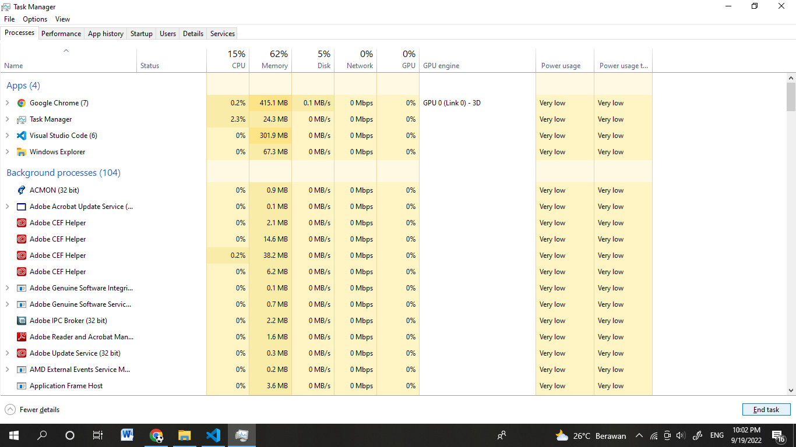

- bisa dilihat pada gambar diatas itu adalah tampilan dari **Task Manager** yang ada pada  laptop saya.
- Terdapat 4 aplikasi yang sedang berjalan diantaranya ada "Google Chrome,TaskManager,Visual Studio Code, dan Windows Explorer".

## Managemen Memori Utama

Memori utama atau lebih dikenal sebagai memori adalah sebuah array yang besar dari word atau byte, yang ukurannya mencapai ratusan, ribuan, atau bahkan jutaan. Setiap word atau byte mempunyai alamat tersendiri. Memori Utama berfungsi sebagai tempat penyimpanan yang akses datanya digunakan oleh CPU atau perangkat I/O. Memori utama termasuk tempat penyimpanan data yang sementara (volatile), artinya data dapat hilang begitu sistem dimatikan.
Sistem operasi bertanggung jawab atas aktivitas-aktivitas yang berkaitan dengan managemen memori seperti:

- Menjaga track dari memori yang sedang digunakan dan siapa yang
menggunakannya.
- Memilih program yang akan di-load ke memori.
- Mengalokasikan dan meng-dealokasikan ruang memori sesuai kebutuhan.

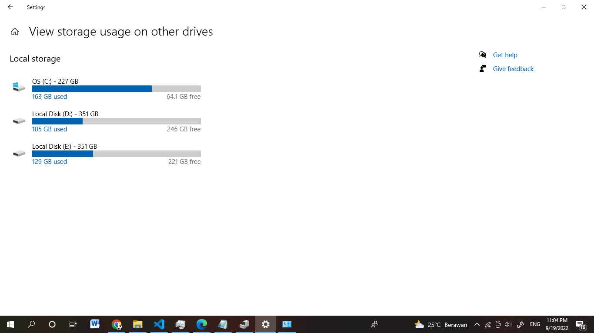

<b>Gambar Local Storage</b>

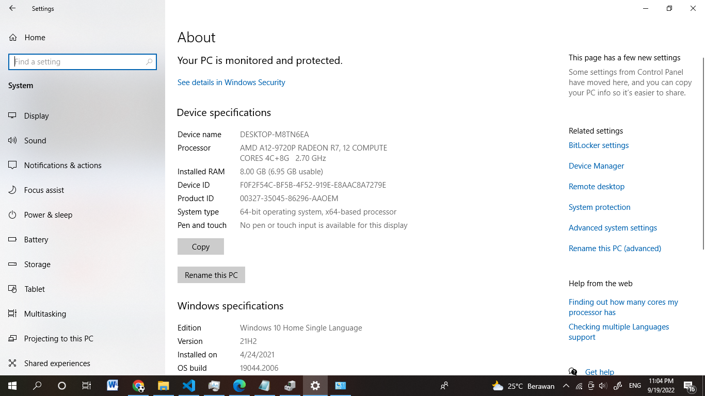

<b>Gambar Total RAM Penyimpanan</b>

- bisa dilihat pada gambar pertama diatas itu adalah tampilan dari **Storage** yang ada pada  laptop saya.
- Terdapat 3 Local Storage yaitu ada partisi C, D, dan E.
- dari ketiga partisi tersebut yang paling banyak di gunakan yaitu partisi C.
- Partisi C paling banyak digunakan karena disitu tempat penginstalan semua aplikasi yang ada pada laptop saya.
- bisa dilihat pada gambar kedua diatas itu adalah tampilan dari **Total RAM** yang ada pada  laptop saya.

## Managemen Sistem I/O

Sering disebut device manager. Menyediakan “device driver” yang umum sehingga operasi I/O dapat seragam (membuka, membaca, menulis, menutup). Contoh: pengguna menggunakan operasi yang sama untuk membaca berkas pada hard-disk, CD-ROM dan floppy disk.

<b align="justify">Komponen Sistem Operasi untuk sistem I/O:</b>

- Buffer: menampung sementara data dari/ ke perangkat I/O.
- Spooling: melakukan penjadualan pemakaian I/O sistem supaya lebih efisien.
- Menyediakan driver untuk dapat melakukan operasi “rinci” untuk perangkat keras I/O tertentu.

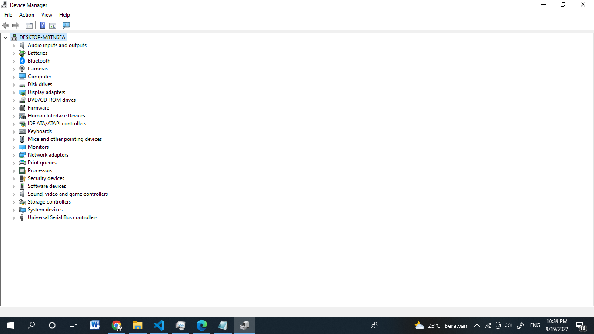

<b>Gambar Device Manager</b>

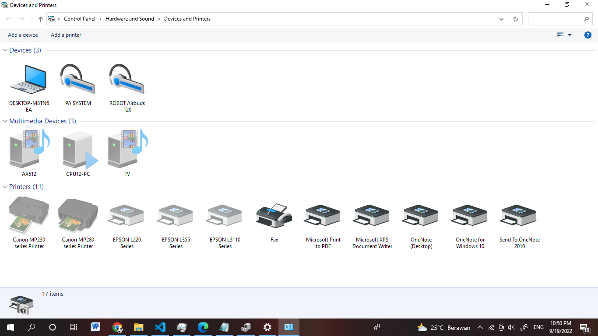

<b>Gambar Devices and Printers</b>

- bisa dilihat pada gambar Device Manager diatas itu adalah tampilan dari **Device Manager** yang ada pada  laptop saya.
- dan gambar kedua terdapat Devices and Printers.
- Manajemen perangkat Input/Output merupakan aspek perancangan sistemoperasi terluas dan kompleks karena sangat beragamnya perangkat dan aplikasinya. Dalam sistem komputer manajemen i/o sangat diperlukan karena i/o adalah sarana user untuk bisa berkomunikasi dengan komputer. Contoh sistem i/o yang ada dilaptop saya sekrang seperti Keyboard, Mouse dan Speaker.

## Command-Interpreter System

Sistem Operasi menunggu instruksi dari pengguna (command driven). Program yang membaca instruksi dan mengartikan control statements umumnya disebut: control-card interpreter, command-line interpreter, dan UNIX shell.
Command-Interpreter System sangat bervariasi dari satu sistem operasi ke system operasi yang lain dan disesuaikan dengan tujuan dan teknologi I/O devices yang ada. Contohnya: CLI, Windows, Pen-based (touch), dan lain-lain.

# Layanan Sistem Operasi

Eksekusi program adalah kemampuan sistem untuk “load” program ke memori dan menjalankan program. Operasi I/O: pengguna tidak dapat secara langsung mengakses sumber daya perangkat keras, sistem operasi harus menyediakan mekanisme untuk melakukan operasi I/O atas nama pengguna. Sistem manipulasi berkas dalah kemampuan program untuk operasi pada berkas (membaca, menulis, membuat, and menghapus berkas). Komunikasi adalah pertukaran data/ informasi antar dua atau lebih proses yang berada pada satu komputer (atau lebih).
Deteksi error adalah menjaga kestabilan sistem dengan mendeteksi “error”, perangkat keras mau pun operasi.

Layanan sistem operasi dirancang untuk membuat pemrograman menjadi lebih mudah.
 

- <b>Pembuatan Program:</b> Sistem operasi menyediakan berbagai fasilitas yang membantu programer dalam membuat program seperti editor. Walaupun bukan bagian dari sistem operasi, tapi layanan ini diakses melalui sistem operasi. 
- <b>Eksekusi Program:</b> Sistem harus bisa me-load program ke memori, dan menjalankan program tersebut. Program harus bisa menghentikan pengeksekusiannya baik secara normal maupun tidak (ada error). 
-<b> Operasi Masukan/Keluaran</b>. Program yang sedang dijalankan kadang kala membutuhkan Masukan/Keluaran. Untuk efisiensi dan keamanan, pengguna biasanya tidak bisa mengatur peranti Masukan/Keluaran secara langsung, untuk itulah sistem operasi harus menyediakan mekanisme dalam melakukan operasi Masukan/Keluaran.
- <b>Manipulasi Sistem Berkas</b>. Program harus membaca dan menulis berkas, dan kadang kala juga harus membuat dan menghapus berkas. 
- <b>Komunikasi</b>. Kadang kala sebuah proses memerlukan informasi dari proses yang lain. Ada dua cara umum dimana komunikasi dapat dilakukan. Komunikasi dapat terjadi antara proses dalam satu komputer, atau antara proses yang berada dalam komputer yang berbeda, tetapi dihubungkan oleh jaringan komputer. Komunikasi dapat dilakukan dengan share-memory atau message-passing, dimana sejumlah informasi dipindahkan antara proses oleh sistem operasi. 
- <b>Deteksi Error</b>. Sistem operasi harus selalu waspada terhadap kemungkinan error. Error dapat terjadi di CPU dan memori perangkat keras, Masukan/Keluaran, dan di dalam program yang dijalankan pengguna. Untuk setiap jenis error sistem operasi harus bisa mengambil langkah yang tepat untuk mempertahankan jalannya proses komputasi. Misalnya dengan menghentikan jalannya program, mencoba kembali melakukan operasi yang dijalankan, atau melaporkan kesalahan yang terjadi agar pengguna dapat mengambil langkah selanjutnya. 

<h1>Contoh Layanan Sistem Operasi yang ada di laptop saya

**1. Microsoft Word**

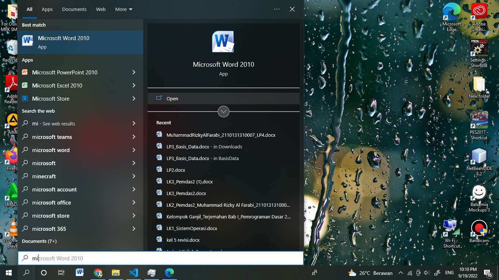

- Cara membuat folder baru di Microsoft Word 2010
    - Buka aplikasi Microsoft Word 2010
    - Maka akan muncul blank space
        - 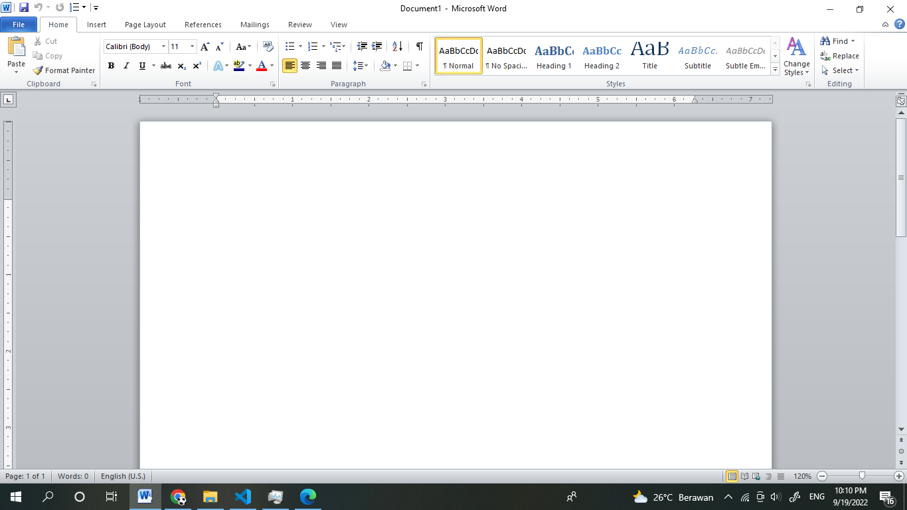
    - Lalu pilih File
    - Lalu setelah itu klik save
    - Lalu muncul seperti gambar dibawah ini
        - 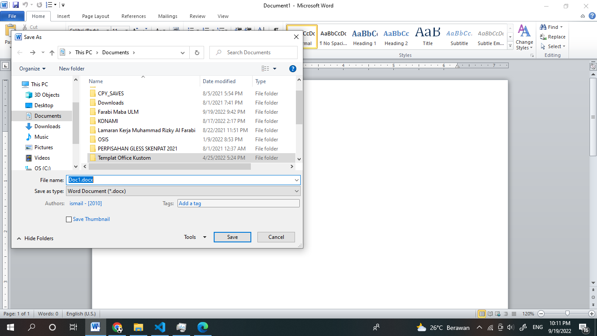
    - Pilih Folder dimana kalian ingin menyimpan nya.
        - 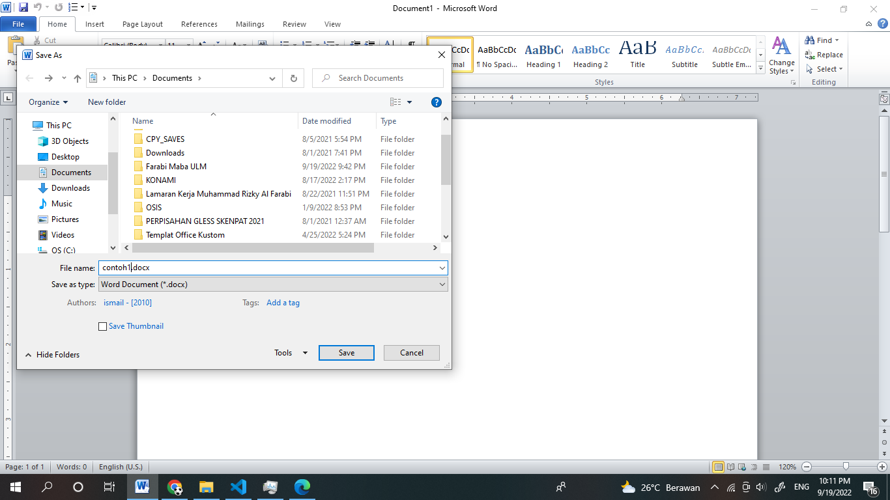
    - Ubah nama file sesuai apa yang kalian inginkan
        - 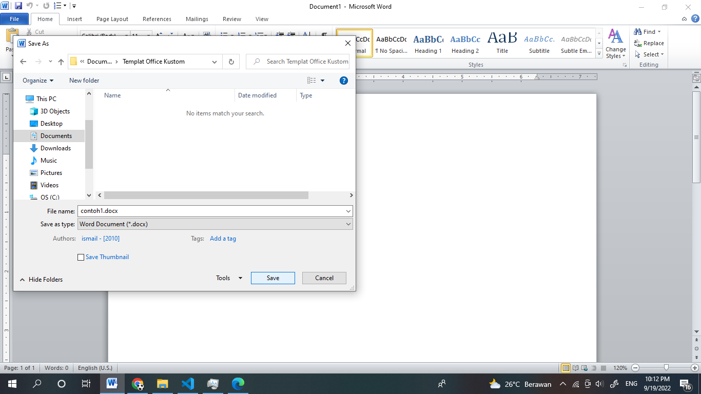
    - Hingga seperti gambar dibawah ini
        - 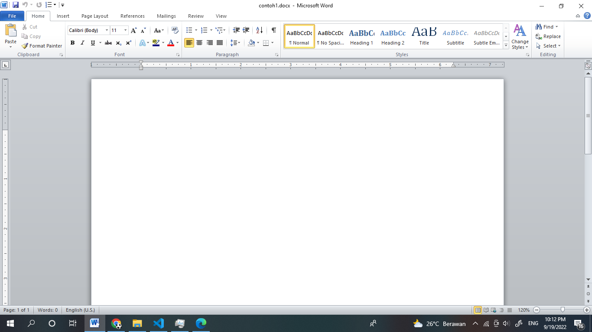
    - File sudah selesai disimpan
  

        
 
 

**2. Adobe Ilustrator 2019**

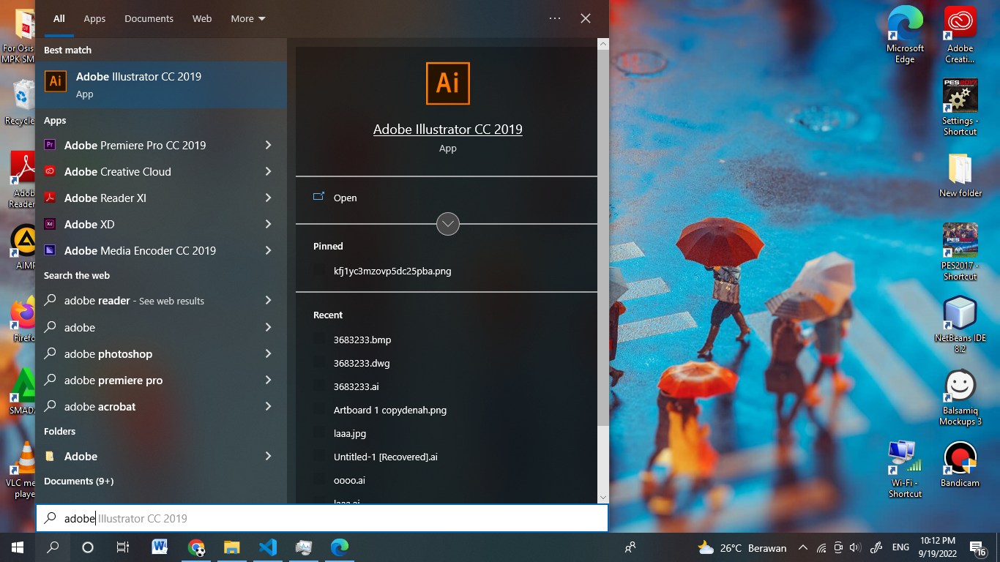

- Cara membuat folder baru di Adobe Ilustrator 2019
    - Buka aplikasi Adobe Ilustrator 2019
        - 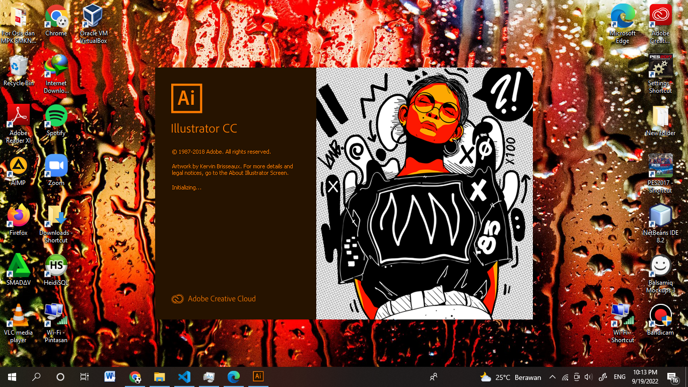
    - Maka akan muncul menu
        - 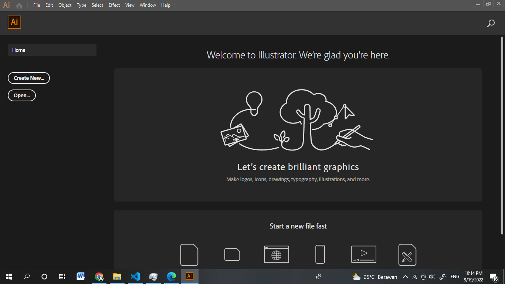
    - Lalu pilih New Document
        - 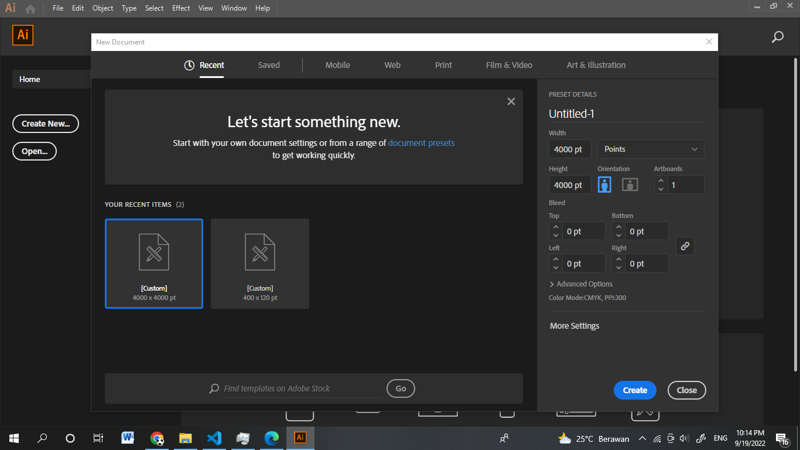
    - Lalu buat nama file misal (contoh2)
        -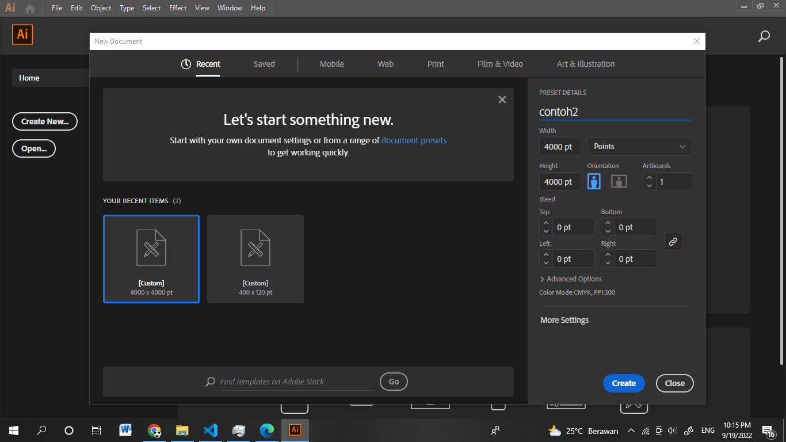
    - Lalu Klik Create jika sudah semua di atur
        -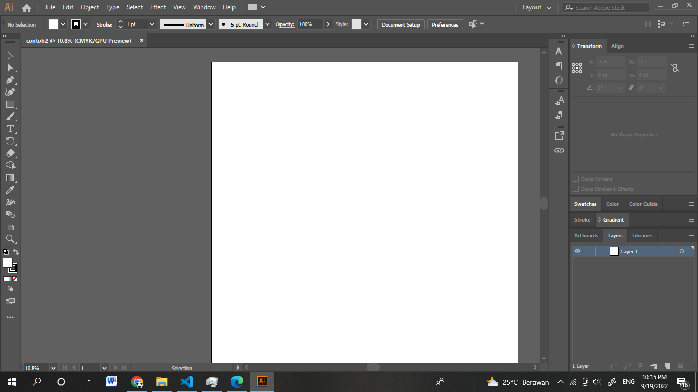
    - Maka Folder Adobe Ilustrator siap digunakan.

 
 

**3. Windows Explorer**

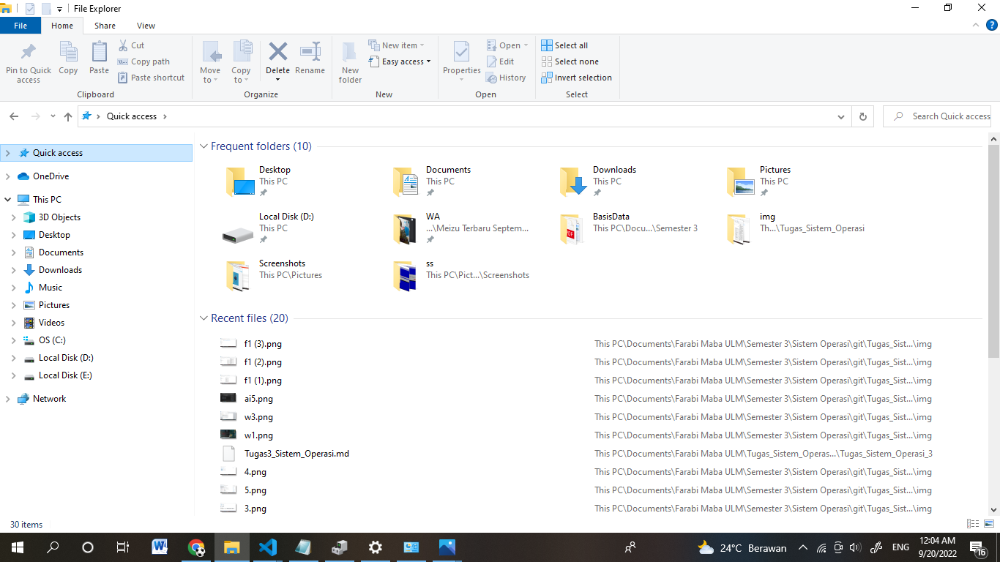

- Cara membuat folder baru
    - Klik kana pada mouse atau Touchpad
    - Maka akan muncul menu
        - 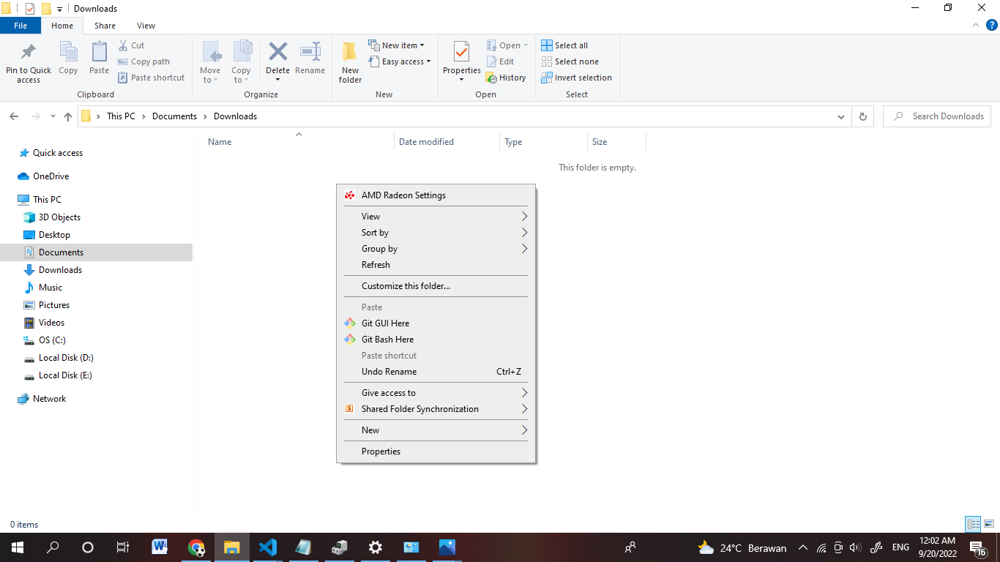
    - Lalu pilih New
    - Lalu pilih folder
        - 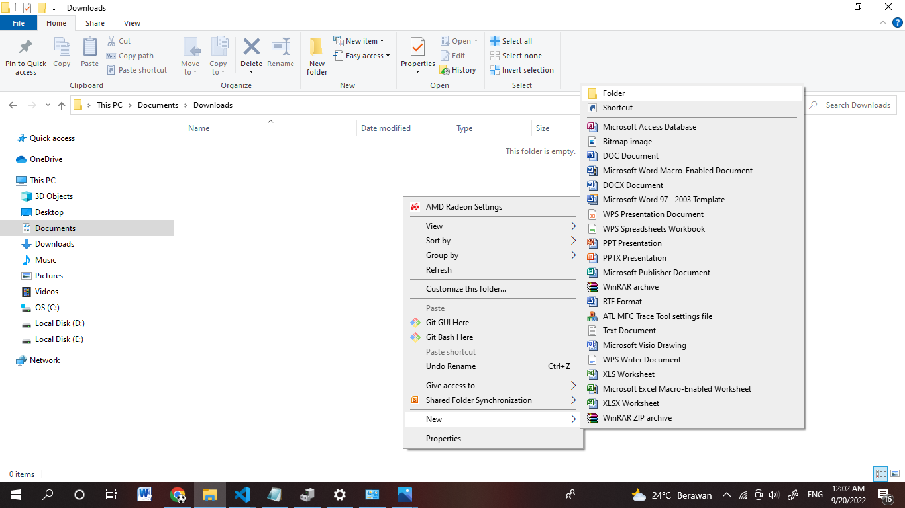
    - Lalu buat nama foldernya contoh DATA KULIAH
        - 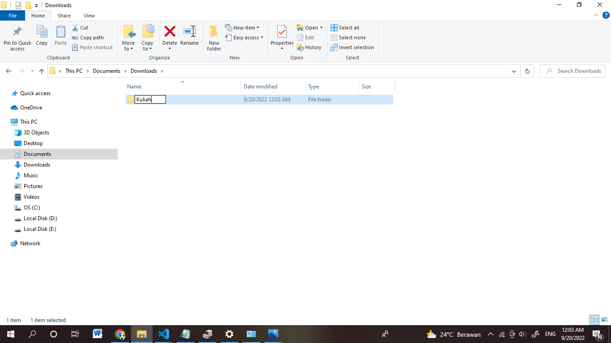
    - Folder siap digunakan.

 
 

# System Call

System call menyediakan interface antara program (program pengguna yang berjalan) dan bagian OS. System call menjadi jembatan antara proses dan system operasi. System call ditulis dalam bahasa assembly atau bahasa tingkat tinggi yang dapat mengendalikan mesin (C). Contoh: UNIX menyediakan system call: read, write => operasi I/O untuk berkas. Sering pengguna program harus memberikan data (parameter) ke OS yang akan dipanggil.

Tiga metode umum yang digunakan dalam memberikan parameter kepada sistem operasi: 

- Melalui register. 
- Menyimpan parameter dalam block atau tabel pada memori dan alamat block tersebut diberikan  sebagai parameter dalam register.
- Menyimpan parameter (push) ke dalam stack oleh program, dan melakukan pop off pada stack  oleh sistem operasi

## Jenis System Call

- <b>System calls</b> yang berhubungan dengan kontrol proses antara lain ketika penghentian pengeksekusian program. Baik secara normal (end) maupun tidak normal (abort). 
- Selama proses dieksekusi kadang kala diperlukan untuk me-load atau mengeksekusi program lain, disini diperlukan lagi suatu system calls. Juga ketika membuat suatu proses baru dan menghentikan sebuah proses. Ada juga system calls yang dipanggil ketika kita ingin meminta dan merubah atribut dari suatu proses. 
- MS-DOS adalah contoh dari sistem single-tasking. MS-DOS menggunakan metoda yang sederhana dalam menjalankan program aan tidak menciptakan proses baru. Program di-load ke dalam memori, kemudian program dijalankan. Berkeley Unix adalah contoh dari sistem multi-tasking. Command Interpereter masih tetap bisa dijalankan ketika program lain dieksekusi. 

## System Call Managemen Proses

- System Call untuk manajemen proses diperlukan untuk mengatur proses-proses yang sedang berjalan. Kita dapat melihat penggunaan system calls untuk manajemen proses pada Sistem Operasi Unix. Contoh yang paling baik untuk melihat bagaimana system call bekerja untuk manajemen proses adalah Fork. Fork adalah satu satunya cara untuk membuat sebuah proses baru pada sistem Unix. Fork membuat duplikasi yang mirip dengan proses aslinya, termasuk file descriptor, register, dan lainnya. 
- Setelah perintah Fork, child akan mengeksekusi kode yang berbeda dengan parentnya. Bayangkan yang terjadi pada shell. Shell akan membaca command dari terminal, melakukan fork pada child, menunggu child untuk mengeksekusi command tersebut, dan membaca command lainnya ketika child terminate. 
- Untuk menunggu child selesai, parent akan mengeksekusi system call waitpid, yang hanya akan menunggu sampai child selesai. Proses child harus mengeksekusi command yang dimasukkan oleh user(pada kasus shell). Proses child melakukannya dengan menggunakan system call exec. 
- Dari ilustrasi tersebut kita dapat mengetahui bagaimana system call dipakai untuk manajemen proses. Kasus lainnya bukan hanya pada Fork, tetapi hampir setiap proses memerlukan system call untuk melakukan manajement proses. 

## System Call Managemen Berkas

- System calls yang berhubungan dengan berkas sangat diperlukan. Seperti ketika kita ingin membuat atau menghapus suatu berkas. Atau ketika ingin membuka atau menutup suatu berkas yang telah ada, membaca berkas tersebut, dan menulis berkas itu. System calls juga diperlukan ketika kita ingin mengetahui atribut dari suatu berkas atau ketika kita juga ingin merubah atribut tersebut. Yang termasuk atribut berkas adalah nama berkas, jenis berkas, dan lain-lain. 
- Ada juga system calls yang menyediakan mekanisme lain yang berhubungan dengan direktori atau sistim berkas secara keseluruhan. Jadi bukan hanya berhubungan dengan satu spesifik berkas. Contohnya membuat atau menghapus suatu direktori, dan lain-lain. 

## System Call Managemen Piranti

- Program yang sedang dijalankan kadang kala memerlukan tambahan sumber daya. Jika banyak pengguna yang menggunakan sistem, maka jika memerlukan tambahan sumber daya maka harus meminta peranti terlebih dahulu. Dan setelah selesai penggunakannnya harus dilepaskan kembali. Ketika sebuah peranti telah diminta dan dialokasikan maka peranti tersebut bisa dibaca, ditulis, atau direposisi. 

## System Call Informasi/Pemeliharaan

- Beberapa system calls disediakan untuk membantu pertukaran informasi antara pengguna dan sistem operasi. Contohnya system calls untuk meminta dan mengatur waktu dan tanggal. Atau meminta informasi tentang sistem itu sendiri, seperti jumlah pengguna, jumlah memori dan disk yang masih bisa digunakan, dan lain-lain. Ada juga system calls untuk meminta informasi tentang proses yang disimpan oleh sistem dan system calls untuk merubah (reset) informasi tersebut. 

## System Call Komunikasi

Dua model komunikasi:
- <b>Message-passing</b>. Pertukaran informasi dilakukan melalui fasilitas komunikasi antar proses yang 
disediakan oleh sistem operasi.
- <b>Shared-memory</b>. Proses menggunakan memori yang bisa digunakan oleh berbagai proses untuk pertukaran informasi dengan membaca dan menulis data pada memori tersebut.

Dalam message-passing, sebelum komunikasi dapat dilakukan harus dibangun dulu sebuah koneksi. Untuk itu diperlukan suatu system calls dalam pengaturan koneksi tersebut, baik dalam menghubungkan koneksi tersebut maupun dalam memutuskan koneksi tersebut ketika komunikasi sudah selesai dilakukan. Juga diperlukan suatu system calls untuk membaca dan menulis pesan (message) agar pertukaran informasi dapat dilakukan. 

## berikut Contoh Sistem Callspada laptop saya adalah:

## **1. System Call di Command Prompt**

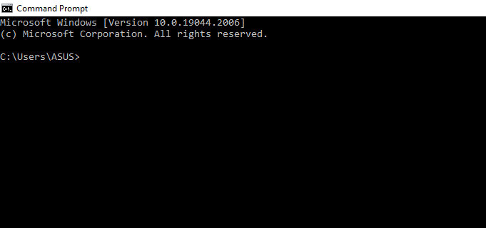

- Cara membuat folder baru
    - ketik mkdir buat nama folder misal (SO)
    - ketik dir untuk melihat folder baru
        - 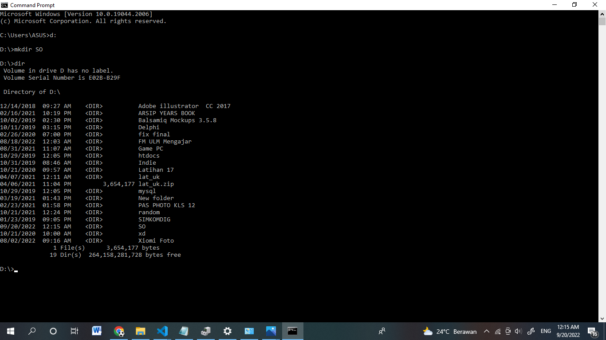

- Cara membuat folder dalam folder
    - ketik mkdir SO\ nama folder misal (Latihan)
    - ketik cd SO
    - lalu tab dan tekan enter
    - maka akan tampil seperti gambar  :
        - 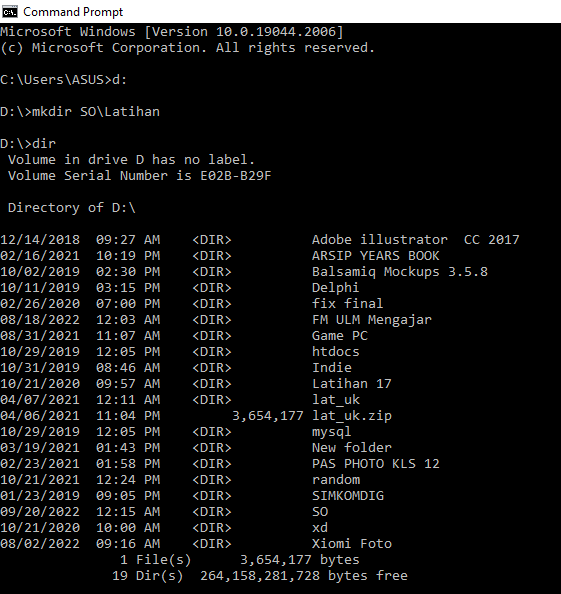
    - lalu ketik dir
    - disitu sudah ada folder Latihan
        - 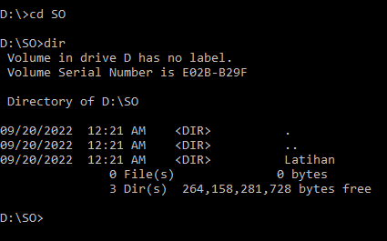

- Cara membuat file txt
    - ketik copy con nama file misal (Latihan1.txt)
        - 
    - lalu ketik dir
    - disitu sudah ada file dengan nama Tugas1.txt
        - 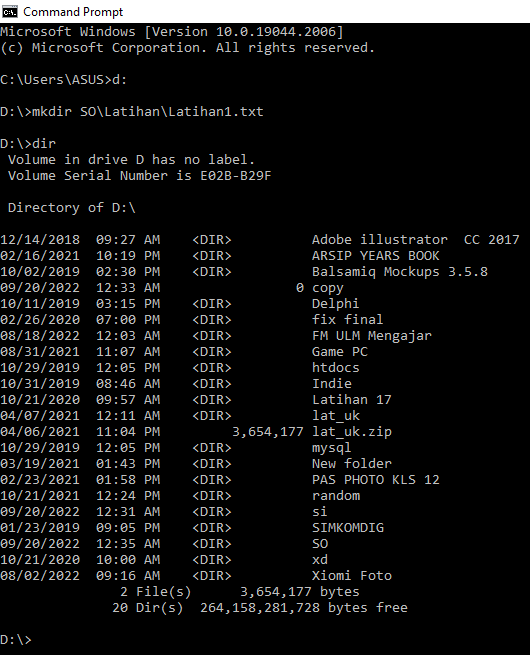

