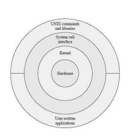
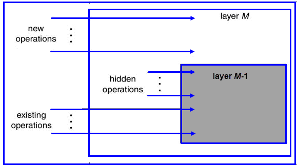
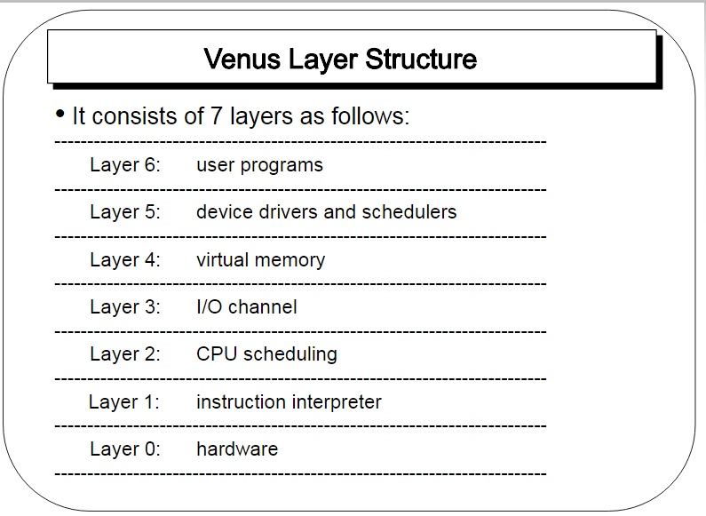
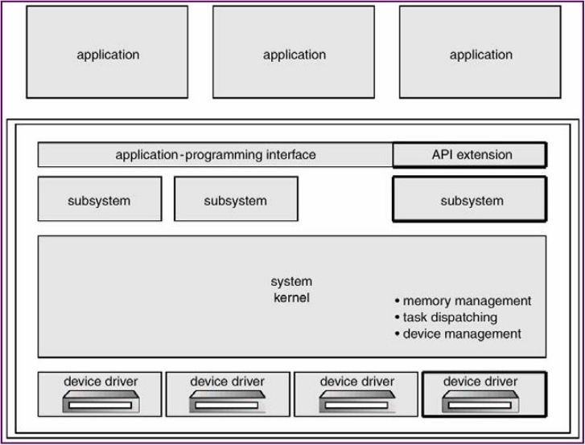

## Tugas 4 Sistem Operasi
Nama   : Muhammad Rizky Al Farabi 
Nim    : 2110131310007

# 
<b>Struktur Sistem Operasi</b>

##  **1. STRUKTUR SEDERHANA**

Beberapa sistem komersial masih belum memiliki stuktur yang cukup baik. Kondisi ini menyebabkan sistem operasi yang digunakan cukup sederhana, kecil, dengan beberapa keterbatasan. Dua contoh sistem tersebut adalah MS DOS dan UNIX, dengan ciri khas :

* MS DOS = fokus pada fungsional tertentu dan tidak dapt dibagi dalam beberapa modul.

* UNIX = fokus pada setiap prosedur yang memanggil prosedur lainnya, sehingga menyebabkan tiap prosedur dapat saling berkomunikasi dan kernel berisikan semua layanan yang disediakan oleh sistem ke pengguna.

Struktur sistem operasi monolitik hanya dapat digunakan pada beberapa perangkat keras saja. Hal ini disebabkan karena sistem operasi monolotik dilengkapi dengan operasi dual mode dan pelayanan system calls. Namun, Intel 8088 tidak dapat menggunakan dual mode sehingga tidak akan ada proteksi pada perangkat keras yang digunakan.

Secara umum, system calls pada sistem operasi monolitik dibuat dengan cara :

* <i>User program</i> melakukan <i>trap</i> pada kernel
* Instruksi akan berpindah dari user mode ke monitor mode
* Kontrol akan berpindah ke sistem operasi dan otomatis akan memeriksa setiap parameter dari pemanggilan tersebut
* Sistem operasi akan menuju ke tabel yang berisikan slot ke -k yang menunjukkan system call k
* Setelah selesai, kontrol akan dikembalikan ke user program

Walaupun mudah digunakan, struktur monolitik memiliki kekurangan yang cukup berbahaya. Program-program malware dapat mudah memodifikasi sistem dan merusak keseluruhan sistem operasi yang anda gunakan.

Selain itu, struktur ini dapat menyebabkan pemborosan jika setiap kernelnya harus menjalankan kernel monolitik yang sangat besar. Perlu diingat juga bahwa satu saja kesalahan pemrograman dari salah satu bagian kernel dapat menyebabkan matinya keseluruhan sistem monolitik yang digunakan.

## 2. Struktur Sistem Operasi Berlapis

Sistem operasi dibentuk secara hirarki berdasar
lapisan-lapisan, dimana lapisan-lapisan bawah
memberi layanan lapisan lebih atas. Lapisan
yang paling bawah adalah perangkat keras, dan
yang paling tinggi adalah user-interface. Sebuah
lapisan adalah implementasi dari obyek abstrak
yang merupakan enkapsulasi dari data dan operasi yang bisa memanipulasi data
tersebut. Struktur berlapis dimaksudkan untuk mengurangi kompleksitas
rancangan dan implementasi sistem operasi. Tiap lapisan mempunyai fungsional
dan antarmuka masukan-keluaran antara dua lapisan bersebelahan. Struktur ini
dibagi menjadi beberapa lapisan. Lapisan terbawah (layer 0) adalah hardware
dan yang tertinggi (layer N) adalah user interface. Lapisan N memberi layanan untuk lapisan N+1 sedangkan proses-proses di lapisan N dapat
meminta layanan lapisan N-1 untuk membangun layanan lapisan N+1.
Lapisan N dapat meminta layanan lapisan N-1 namun lapisan N tidak dapat
meminta layanan lapisan N+1. Masing-masing berjalan pada lapisannya sendiri.

Contoh Model Lapisan dari Stallings yang lebih detail, sebagai berikut:

- Lapisan 1. Berisi berbagai sirkuit elektronik, misal register, memory cells, dan logic gate.
- Lapisan 2. Berisi instruksi prosesor, misal instruksi aritmatika, instruksi transfer data, dsb.
- Lapisan 3. Penambahan konsep seperti prosedur/subrutin, maupun fungsi yang me-return nilai tertentu.
- Lapisan 4. Penambahan interrupt.
- Lapisan 5. Program sebagai sekumpulan instruksi yang dijalankan oleh prosesor.
- Lapisan 6. Berhubungan dengan secondary storage device, yaitu membaca/menulis head, track, dan sektor.
- Lapisan 7. Menciptakan alamat logika untuk proses. Mengatur hubungan antara main memory, virtual memory, dan secondary memory.
- Lapisan 8. Program sebagai sekumpulan instruksi yang dijalankan oleh prosesor.
- Lapisan 9. Berhubungan dengan secondary storage device, yaitu membaca/menulis head,track, dan sektor.
- Lapisan 10. Menciptakan alamat logika untuk proses. Mengatur hubungan antara main memory, virtual memory, dan secondary memory.
- Lapisan 11. Program sebagai sekumpulan instruksi yang dijalankan oleh prosesor.
- Lapisan 12. File adalah objek yang memiliki nama dan ukuran. Abstraksi dari lapisan 9.
- Lapisan 13. Menyediakan interface agar bisa berinteraksi dengan pengguna.

Lapisan-lapisan dari 1-4 bukanlah bagian dari sistem operasi dan masih menjadi bagian dari prosesor
secara ekslusif

Lapisan ke-5 hingga ke-7, sistem operasi sudah berhubungan dengan prosesor. Selanjutnya dari lapisan
ke-8 hingga 13, sistem operasi berhubungan dengan media penyimpanan maupun perlatan-peralatan
lain yang ditancapkan, misalnya peralatan jaringan.

Contoh sistem yang memiliki struktur berlapis adalah seperti berikut : 

- THE (Technische Hogeschool at Eindhoven)

Merupakan sistem operasi pertama yang dibuat dengan sistem lapisan. THE dibuat oleh djikstra dan mahasiswa-mahasiswanya.
THE adalah sistem yang memiliki struktur 6 lapisan seperti :

Lapis 5 - The operator
=> Untuk pemakai/operator.

Lapis 4 - User programs
=> Untuk aplikasi program pemakai.

Lapis 3 - I/O management
=> Menyederhanakan akses I/O pada level atas.

Lapis 2 - Operator-operator communication
=> untuk mengatur komunikasi antar proses.

Lapis 1 - Memory and drum management
=> untuk mengatur alokasi ruang memori atau drum magnetic.

Lapis 0 - Processor allocation and multiprogramming
=> untuk mengatur alokasi pemroses dan switching, multi programming dan
pengaturan prosessor. 

Struktur THE dirancang agar sistem dapat membagi tugas pokok menjadi
beberapa modul dan tiap modul dirancang secara independen. Tiap lapisan
dapat dirancang, dikode dan diuji secara independen. struktur berlapis juga
dapat menyederhanakan rancangan, spesifikasi dan implementasi sistem
operasi. 

- Multics

Multiplexed Information and Computing System atau biasa disingkat MULTICS adalah Sebuah Sistem Operasi yang digunakan pada komputer-komputer mainframe untuk keperluan server jaringan. Pada tahun tahun 1965, MULTICS merupakan satu–satunya Sistem Operasi dengan fasilitas sistem multi user.

Pengembangan MULTICS adalah hasil kerjasama antara Bell Telephone Labs dan MIT. Dua orang staf pengembang perangkat lunak di Bell labs, yakni Ken Thompson dan Dennis Ritchie yang juga pembuat bahasa pemrograman C adalah orang–orang penting dalam proyek MULTICS. Dan software yang pertama kali mereka buat adalah game multi user yang dikenal dengan nama Space Travel. Kemudian berselang beberapa tahun, munculah Unix sebagai pengembangan dari MULTICS.

- Venus OS

Sistem Operasi Venus adalah sebuah eksperimen sistem multiprogramming yang mendukung lima atau enam pengguna bersamaan di komputer kecil. Sistemnya adalah diproduksi untuk menguji pengaruh arsitektur mesin kompleksitas perangkat lunak. Sistem didefinisikan oleh a kombinasi mikroprogram dan perangkat lunak.

Lapis-6 : user program

Lapis-5 : device driver dan sceduler

Lapis-4 : virtual memory

Lapis-3 : I/O channel

Lapis-2 : penjadwalan CPU

Lapis-1 : instruksi interpreter

Lapis-0 : hardware

- IBM OS/2

IBM OS/2 adalah sistem operasi yang dibuat secara bersama-sama oleh International Business Machine Corporation dan Microsoft Corporation (Sampai versi 1.2) , untuk digunakan pada komputer IBM PS/2, (pengganti komputer IBM PC/AT), sebagai pengganti sistem operasi DOS yang telah lama digunakan. Kata OS/2 adalah singkatan dari Operating System/2. Pengembangan sistem operasi ini dilakukan oleh kedua perusahaan tersebut, dengan menggunakan perjanjian Joint Development Agreement (JDA) yang ditandatangani pada tahun 1987. Sistem operasi tersebut didesain agar dapat menggunakan kemampuan penuh dari mikroprosesor Intel 80286, termasuk di antaranya adalah modus terproteksi (protected mode), mampu menjalankan banyak tugas secara simultan (multitasking), serta mendukung memori virtual, dengan tetap mempertahankan kompatibilitas dengan banyak perangkat lunak Windows 3.x yang beredar saat itu (Bahkan lebih baik daripada Windows itu sendiri ), serta dapat membaca semua cakram (disk) yang diformat dengan menggunakan format DOS.

- Kelebihan Struktur Berlapis

1. Karena sistem dibagi menjadi beberapa modul, tiap lapisan dapat dirancang dan diuji secara independen.
2. Mempermudah debug dan verifikasi sistem.
3. Lapisan pertama bisa didebug tanpa mengganggu sistem yang lain karena hanya menggunakan perangkat keras dasar untuk implementasi fungsinya.
4. Bila terjadi error saat debugging sejumlah lapisan, error pasti pada lapisan
yang baru saja didebug, karena lapisan dibawahnya sudah di debug. 

- Kelemahan Struktur Berlapis
1. Fungsi-fungsi sistem operasi harus diberikan ke setiap lapisan secara hati-hati. 

## 3. Kernel Mikro

Kernel mikro adalah sistem operasi yang mempermudah komunikasi antara program klien dengan beragam layanan pada ruang user. Komunikasi yang terjadi antar module user menggunakan passing massage. Kernel mikro dapat memperluas sistem operasi dan mudah diatur jika ada transformasi ke arsitektur yang baru. Kode program yang digunakan pada sistem ini juga lebih kecil dan lebih aman. Beberapa manfaat yang dapat anda terima dari struktur sistem mikro kernel adalah :

- Mudah untuk dikembangkan
- Mudah untuk porting sistem operasi ke arsitektur baru
- Mudah diandalkan
- Hanya menggunakan sedikit kode
- Lebih aman

Walaupun demikian, struktur sistem mikro kernel sering mengalami overhead kinerja dari komunikasi ruang ke pengguna ruang kernel. Pastikan anda sudah mempertimbangkan kekurangan ini sebelum menerapkan struktur sistem mikro kernel. Beberapa sistem operasi yang menerapkan mikro kernel adalah :

- Tru64 UNIX
- MacOSX
- QNX