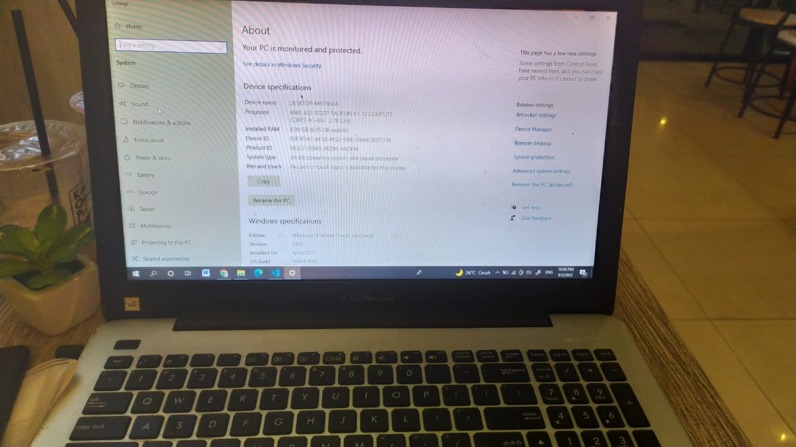
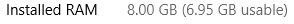
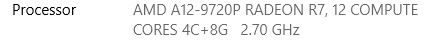
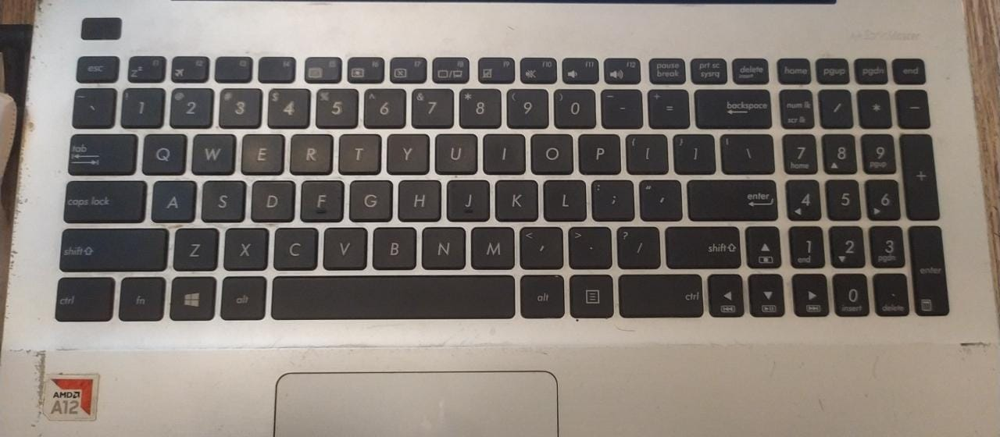
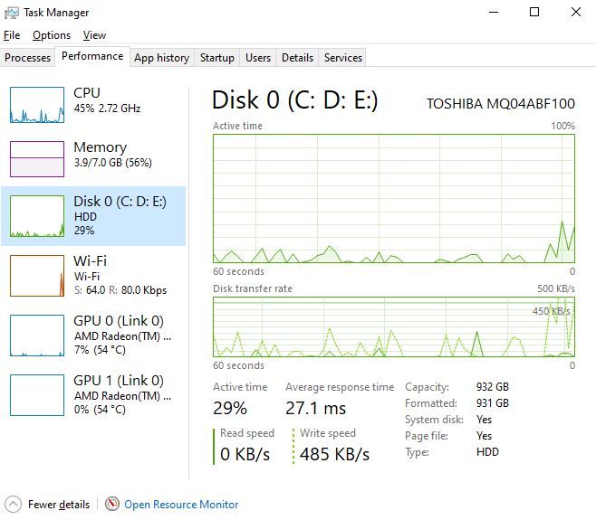

# TUGAS 1 SISTEM OPERASI

## Nama : Muhammad Rizky Al Farabi
## Nim  : 2110131310007 

## __Nomor 1__

## - Laptop 
>Saya mempunyai laptop ASUS yang dibelikan ayah saya sejak awal masuk sekolah SMK, Kegunaan Laptop ini tentu sangat berguna untuk menunjang saya dalam menjalani sekolah di bidang IT dan Manfaat Laptop ini bisa membuat saya mengerjakan Tugas sendiri tanpa harus meminjam laptop pada orang lain.

><h2>Device Specification
><h4><b>Device name:</b> 	DESKTOP-M8TN6EA
><h4><b>Processor:</b>	AMD A12-9720P RADEON R7, 12 COMPUTE CORES 4C+8G   2.70 GHz
><h4><b>Installed:</b> RAM	8.00 GB (6.95 GB usable)
><h4><b>Device ID:</b>	F0F2F54C-BF5B-4F52-919E-E8AAC8A7279E
><h4><b>Product ID:</b>	00327-35045-86296-AAOEM
><h4><b>System type:</b>	64-bit operating system, x64-based processor
><h4><b>Pen and touch:</b>	No pen or touch input is available for this display

## - Sistem Operasi
>Sebuah sistem yang dibutuhkan agar dapat menjalankan semua palikasi program/software yang ada di Laptop atau __Sistem Operasi__ yang saya gunakan adalah __Windows 10__, ya di ketahui Semua windows menjadi Sistem Operasi yang paling bnayak digunakan di PC/Laptop karena Windows menyediakan Lingkungan berbasih Grafis dan juga Mempunyai Kemampuan Multitasking. Dan dapat kita ketahui bersama perkembangan windows dari tahun ketahun sangat bagus yang dimana tiap tahunnya terdapat beberapa perubahan dan termasuk penambahan beberapa fitur yang sebelumnya tidak ada menjadi ada.
><h3>Windows Specifications
><h5>Edition: Windows 10 Home Single Language
><h5>Version: 21H2
><h5>Installed on: 4/‎24/‎202
><h5>OS build: 19044.1889
><h5>Experience: Windows Feature Experience Pack 120.2212.4180.0

## - Prosesor
>Menurut Saya Processor merupakan salah satu komponen terpenting pada laptop saya. Fungsinya adalah sebagai otak dari laptop, karena komponen ini bertugas untuk menjalankan sebaian besar perintah yang ada di laptop saya. Maka tidak heran jika semakin besar spesifikasi processornya, semakin kencang pula performa laptopnya.
### Prosesor yang terdapat di Laptop saya adalah: 
__*AMD A12-9720P RADEON R7, 12 COMPUTE CORES 4C+8G   2.70 GHz*__

## - Software
ada cukup banyak Software yang terinstal di Laptop saya diantaranya:
><h3>1. Microsoft Office</h3>
>dibagian ini terdapat 3 Software yaitu ada Word,Excel, dan juga PowerPoint.
><h3>2. Chrome
><h3>3. FireFox
><h3>4. Adobe Reader XI</h2>

dan masih banyak Software lain yang ada pada laptop saya, dan bagi saya masing" software yang adaa di laptop saya ini tentunya mempunyai kegunaan masing dan salah satu contoh software Microsoft yang paling sering saya gunakan apalagi word yang dimana software word dapat memfasilitasi saya untuk mengetik suatu laporan dan sama juga seperti power point dapat membantu saya dalam membuat media presentasi.

## - Hardware
untuk bagian-bagian hardware yang ada pada laptop saya lumayan banyak diantaranya:
><h3>1. RAM

><h3>2. CPU 

><h3>3. Keyboard

## - Penyimpanan(Primer/Sekunder)
dibagian penyimpanan laptop saya memiliki Memory Sebesar 8gb dan HDD sebesar 1TB, tentu saja penyimpanan ini sangat berarti bagi saya karena dengan keperluan saya dalam menggunakan software dan juga untuk menyimpan file tugas,foto dan lain halnya saya perlu memori yang cukup besar agar bisa menampung itu semua 

## __Nomor 2__

<h2>Eksplorisasi sejarah perkembangan Komputer</h2>

Sebelum dilengkapi oleh fitur serba canggih seperti sekarang ini, perkembangan komputer diawali dari sebuah inovasi sederhana yang lahir sejak tahun 1800-an.

<h3><b>Munculnya komputer pertama</h3>

- Komputer pertama kali ditemukan pada 1822 oleh seorang ahli matematika asal Inggris, Charles Babbage. Mulanya, Babbage bermaksud untuk menciptakan sebuah mesin hitung bertenaga uap yang dapat menghitung tabel angka.
Mesin tersebut kemudian ia beri nama "Difference Engine 0" dan digadang-gadang sebagai komputer pertama di dunia. Bentuk Difference Engine 0 sendiri sangat jauh berbeda dari kebanyakan model komputer modern saat ini.

<h3><b>Cikal bakal komputer digital</h3>

- Komputer digital pertama dikembangkan oleh Konrad Zuse, seorang insinyur mesin asal Jerman. Sebelum perang dunia kedua pecah, Zuse membangun komputer digital pertama bernama Z1 yang dapat diprogram. Pada 1936 di ruang tamu orang tuanya di Berlin, ia merakit pelat logam, pin, dan menciptakan sebuah mesin yang dapat melakukan perhitungan tambah dan kurang.

<h3><b>Lahirnya bahasa pemrograman</h3>

-   Pada 1954, bahasa pemrograman dicetuskan untuk pertama kalinya oleh ilmuwan komputer wanita bernama Grace Hopper. Bahasa pemrograman bernama COBOL ini hadir untuk membantu pengguna komputer dalam menyampaikan perintah dalam bahasa Inggris.

    Sebab sebelumnya, pengguna komputer hanya dapat memberikan instruksi pada komputer menggunakan kumpulan baris angka. Sejak saat itu, bahasa pemrograman kemudian ikut berkembang seiring dengan evolusi yang terjadi komputer.Selanjutnya, terciptalah bahasa pemrograman baru bernama FORTRAN, yang dikembangkan oleh tim pemrograman IBM yang dipimpin oleh John Backus pada tahun 1954.

<h3><b>Komputer pribadi</h3>

-   Tahun 1970-an dapat dibilang sebagai era kelahiran komputer pribadi. Ditandai dengan munculnya Xerox Alto, sebuah komputer pribadi yang dapat menjalankan perintah seperti mengirimkan e-mail dan mencetak (print) dokumen.

-   Satu hal yang paling beda dari Xerox Alto adalah desainnya yang sudah menyerupai komputer modern. Sebab, komputer ini telah dilengkapi dengan mouse, keyboard, serta layar.

-   Di tahun yang sama, beberapa penemuan besar turut terjadi. Beberapa di antaranya seperti diciptakannya disket, ethernet, serta chip Dynamic Access Memory (DRAM).

-   Sementara itu, Apple mulai didirikan pada tahun 1976 oleh Steve Jobs dan Steve Wozniak. Keduanya turut memperkenalkan Apple I, sebuah komputer single-circuit pertama.

-   Desain komputer pribadi kemudian disempurnakan oleh IBM, lewat sebuah perangkat bernama Acorn. Komputer ini sudah dilengkapi dengan chip Intel, dua slot disket, keyboard, serta layar monitor yang berwarna.

<h3><b>Komputer era 2000-an</h3>

-   Memasuki abad ke-21, laju perkembangan perangkat komputer semakin pesat, seiring dengan perkembangan teknologi.
Penggunaan disket dan CD-ROM mulai tersisihkan oleh media penyimpanan portabel yang lebih canggih, yakni USB drive.
Sementara itu, Apple semakin gencar menelurkan inovasi terbaru lewat sistem operasi bernama Mac OS X. Microsoft pun sebagai kompetitor juga meluncurkan sistem operasi yang lebih modern, Windows XP.

<h3><b>Internet of Things</h3>

-   Tahun 2011 ditandai sebagai tahun lahirnya berbagai penemuan Internet of Things (IoT). Nest Learning Thermostat yang hadir pada tahun ini kemudian dikenal sebagai perangkat IoT pertama di dunia.
Selanjutnya, berbagai produk IoT lainnya semakin menjamur di pasaran. Sebut saja seperti Apple Watch yang hadir pada 2015.
Untuk pertama kalinya, Apple turut mengumumkan iPadOS, sebuah sistem operasi yang dikhususkan untuk iPad.